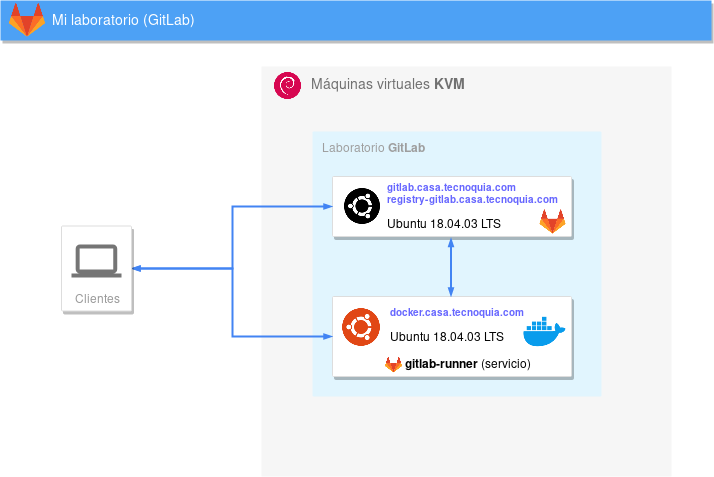
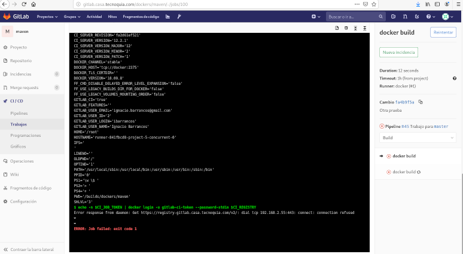
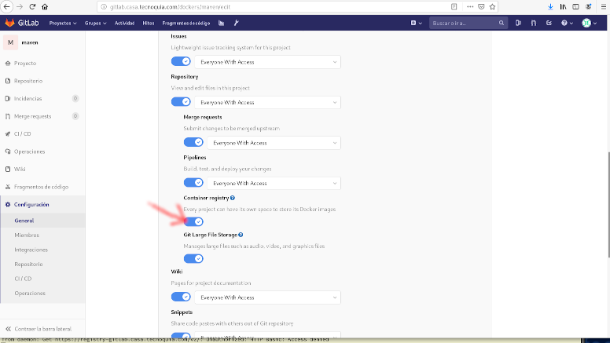
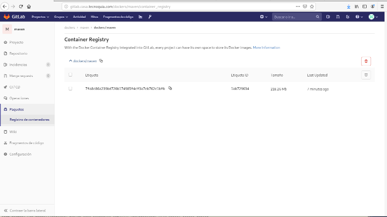

## GitLab-Runner

En mi laboratorio Ubuntu 18.04.03 LTS, tengo:



* ```gitlab.casa.tecnoquia.com``` con GitLab 12.2.3 con el *registry* de GitLab habilitado en ```registry-gitlab.casa.tecnoquia.com```, corriendo sobre Ubuntu 18.04.03 LTS,

* ```docker.casa.tecnoquia.com```, un equipo Ubuntu 18.04.03 LTS sobre el que habilité docker, y en el que instalé como servicio *gitlab-runner*.

Las dos equipos corren en máquinas virtuales KVM sobre Debian7. Después de actualizar los Ubuntu hasta el máximo, me pongo a trabajar en un **proyecto que mediante GitLab-CI pretende ejecutar un ```docker build``` y un ```docker pull``` a ```registry-gitlab.casa.tecnoquia.com``` de una imagen Docker** basada en maven a la que personalizaba algunos ficheros. Este es el ```.gitlab-ci.yml``` del proyecto:

```
# Inspiración: https://blog.callr.tech/building-docker-images-with-gitlab-ci-best-practices/ 
image: docker:18

stages:
  - Build
  - Push

#
# Use this if your GitLab runner does not use socket binding
#services:
#  - docker:dind
#

before_script:
  # Construir el nombre de la imagen        
  - 'export CI_REGISTRY_IMAGE="$CI_REGISTRY/$CI_PROJECT_PATH"'
  - set  
  # Comprobar la conectividad del runner con el demonio de dockerd
  #- docker info
  # Autenticarnos en el registro, si no, no funciona el push
  - echo -n $CI_JOB_TOKEN | docker login -u gitlab-ci-token --password-stdin $CI_REGISTRY


docker build:
  stage: Build
  script:
    # Intenta traerse la última imagen (si no, tampoco pasa nada)
    - docker pull $CI_REGISTRY_IMAGE:latest || true
    # Construcción de la imagen
    - >
      docker build
      --pull
      --build-arg VCS_REF=$CI_COMMIT_SHA
      --build-arg VCS_URL=$CI_PROJECT_URL
      --cache-from $CI_REGISTRY_IMAGE:latest
      --tag $CI_REGISTRY_IMAGE:$CI_COMMIT_SHA
      .
    # Push de la imagen recién creada
    - docker push $CI_REGISTRY_IMAGE:$CI_COMMIT_SHA
      

docker push:
  stage: Push
  only:
    - master
  script:
    - echo "$REGISTRY_PASSWORD" | docker login -u "$REGISTRY_USER" --password-stdin
      #    - docker push 
```

Tras la actualización de Ubuntu, al hacer un *commit* en el proyecto, cuando intenta ejecutar:

```
echo -n $CI_JOB_TOKEN | docker login -u gitlab-ci-token --password-stdin $CI_REGISTRY
```

el erroor que obtengo es:

```
 Error response from daemon: Get https://registry-gitlab.casa.tecnoquia.com/v2/: dial tcp 192.168.2.55:443: connect: connection refused
```

Compruebo, desde el gitlab-runner:

```
 nmap registry-gitlab.casa.tecnoquia.com
```

...y el puerto está abierto correctamente:

```
Starting Nmap 7.60 ( https://nmap.org ) at 2019-08-30 18:28 CEST
Nmap scan report for registry-gitlab.casa.tecnoquia.com (192.168.2.55)
Host is up (0.00011s latency).
rDNS record for 192.168.2.55: gitlab.casa.tecnoquia.com
Not shown: 996 closed ports
PORT    STATE SERVICE
22/tcp  open  ssh
25/tcp  open  smtp
80/tcp  open  http
443/tcp open  https
MAC Address: 52:54:00:97:39:3C (QEMU virtual NIC)
```

Cuando ejecuto ```service gitlab-runner status```, simplemente obtengo...

```
ago 30 20:06:30 docker gitlab-runner[18924]: ERROR: Failed to process runner    builds=0 error=exit code 1 executor=docker runner=841fbcd8
```

Compruebo desde el navegador [https://registry-gitlab.casa.tecnoquia.com/v2/](https://registry-gitlab.casa.tecnoquia.com/v2/) y me canta el certificado (no confía en quien lo firma), pero la URL está accesible y funciona:

```
{"errors":[{"code":"UNAUTHORIZED","message":"authentication required","detail":null}]}
```

Supongo que al *gitlab-runner* lo que le falta es alguna configuración del certificado. Aumento el verbose del gitlab-runner editando el fichero ```/etc/gitlab-runner/config.toml```:

```
concurrent = 1
check_interval = 0
log_level = "debug"

[[runners]]
  name = "docker"
  url = "http://gitlab.casa.tecnoquia.com/"
  token = "841fbcd81e0b03d7c499146ca8d6ee"
  executor = "docker"
  [runners.docker]
    tls_verify = false
    image = "docker:18"
    privileged = true
    disable_cache = false
    volumes = ["/cache"]
    shm_size = 0
    dns = ["192.168.2.20","8.8.8.8"]
    dns_search = ["casa.tecnoquia.com"]
  [runners.cache] 
```

...y vuelvo a reintentar el último pipeline, observando lo que aparece en los logs *(``` grep gitlab-runner  /var/log/syslog ```)*: Vuelve a fallar de la misma manera, pero **me sorprende comprobar que *gitlab-runner* lanza 6 contenedores !!**, imagino que son uno por cada línea de script que debe ejecutar, independientemente del stage y de que hayan acabado, se tenga que ejecutar o no... el los lanza y luego los detiene y elimina. Toda una sorpresa. Con esto deduzco que en realidad el problema no está en un problema de comunicación entre gitlab-runner y el registry, sino en que los contenedores que manda ejecutar con ```docker:18``` no saben nada de *registry-gitlab.casa.tecnoquia.com*, no tienen ese certificado y no pueden autenticarse en el registry, aunque sí lo resuelven bien porque añadí las líneas ```dns*``` a ```/etc/gitlab-runner/config.toml```...

Para depurar este problema decido levantar manualmente el contenedor y probar a ver qué necesita, similar a lo que intuyo que hace *gitlab-runner*:

```
docker run -i -e TZ=Europe/Madrid  --dns-search=casa.tecnoquia.com --dns=192.168.2.20 --dns=8.8.8.8 --name pruebas  docker:18
```

Esto es un Alpine Linux 3.10, y el intérprete de órdenes es busybox, un poco tortura :(... Ya en la shell de busybox *(sin prompt)* ejecuto ```cat /etc/resolv.conf``` y verfico que lo ha creado correctamente. Si ejecuto:

```
echo -n prueba | docker login -u gitlab-ci-token --password-stdin registry-gitlab.casa.tecnoquia.com
```

...obtengo el mismo error que obtenía cuando se lanzaba el Pipeline desde GitLab (para salir del contenedor ```exit```). Bien, si ahora ejecuto:

```
docker container rm pruebas
docker run -i -e TZ=Europe/Madrid --name pruebas  docker:18
```

...y vuelvo a ejecutar el mismo comando ```docker login``` de antes, obtengo:

```
error during connect: Post http://docker:2375/v1.39/auth: dial tcp: lookup docker on 192.168.2.20:53: no such host
```

...que casualmente es similar a lo que me pasaba en los servidores del trabajo esta mañana: Claro, no conoce el host *docker*, tenemos que decirle que en realidad es el contenedor que lo está ejecutando (pasa que yo en mi laboratorio hice que la máquina casualmente también se llamara *docker*)...

```
docker container rm pruebas
docker run -i -e TZ=Europe/Madrid --add-host docker:192.168.2.56 --name pruebas  docker:18
```

...y ahora obtengo:

```
Error response from daemon: Get https://registry-gitlab.casa.tecnoquia.com/v2/: net/http: request canceled (Client.Timeout exceeded while awaiting headers)
```

Compruebo que ```nslookup registry-gitlab.casa.tecnoquia.com```, resuelve bien: Se que el ```docker run``` ya le pasa al menos la configuración del dns para que la añada a ```/etc/resolv.conf```, pero si no le indica zona búsqueda deja ```search lan```... Volvemos a probar con todo...

```
docker container rm pruebas
docker run -i -e TZ=Europe/Madrid --add-host docker:192.168.2.56 --dns-search=casa.tecnoquia.com --dns=192.168.2.20 --dns=8.8.8.8 --name pruebas  docker:18
```

...y ahora el error es diferente!!

```
Error response from daemon: Get https://registry-gitlab.casa.tecnoquia.com/v2/: unauthorized: HTTP Basic: Access denied
```

...que más bien parece que el problema es que la clave que estoy usando está mal, cosa que ya sabía!.

Ok, pues la conclusión que saco de todo esto es que hay que:

1. La configuración del gitlab-runner, debe tener la IP de nuestros DNSs y la zona de búsqueda
2. Debemos añadirle a /etc/host la IP del servidor que ejecuta docker (con nombre docker)

Vale, mirando la [configuración del GitLab-Runner](https://docs.gitlab.com/runner/configuration/advanced-configuration.html) esto dejaría  el fichero ```/etc/gitlab-runner/config.toml``` mi Runner como :

```
concurrent = 1
check_interval = 0
log_level = "debug"

[[runners]]
  name = "docker"
  url = "http://gitlab.casa.tecnoquia.com/"
  token = "841fbcd81e0b03d7c499146ca8d6ee"
  executor = "docker"
  [runners.docker]
    tls_verify = false
    image = "docker:18"
    privileged = true
    disable_cache = false
    volumes = ["/cache"]
    shm_size = 0
    dns = ["192.168.2.20","8.8.8.8"]
    dns_search = ["casa.tecnoquia.com"]
    extra_hosts = ["docker:192.168.2.56"]
  [runners.cache] 
```

Lo cambio y reinicio el runner:

```
service gitlab-runner restart
```

Vuelvo a lanzar la tarea pero encuentro un error nuevo:

```
Error response from daemon: Get https://registry-gitlab.casa.tecnoquia.com/v2/: net/http: request canceled (Client.Timeout exceeded while awaiting headers)
```

En los foros dicen que es por el cortafuegos de la ubuntu: Lo detengo y deshabilito en los dos nodos, en el de gitlab y en el docker:

```
systemctl stop ufw
systemctl disable ufw
systemctl status ufw
```

Relanzo la prueba y tampoco. Miro en los logs de GitLab (```/var/log/gitlab/nginx/```), repito pruebas con ```tcpdump``` y nada, siempre obtengo lo mismo. Dedico volver a probar desde el contenedor manual, pero para ello necesito la clave ```CI_JOB_TOKEN``` que cada vez que intento imprimirla me muestra *[MASKED]*. Lo que hago para verla es modificar el fichero ```.gitlab-ci.yml``` , para en vez del ```set``` dejar:

```
- 'echo  "a-$CI_JOB_TOKEN-b" >/tmp/a && cat /tmp/a'
```

...y luego añadir a ```/etc/gitlab-runner/config.toml```, un volumen:

```
volumes = ["/cache","/tmp-pruebas:/tmp:rw"]
```

...con lo que le decimos al runner, que el ```/tmp``` de los contenedores que levante se mapee al directorio ```/tmp-pruebas``` del equipo que los ejecuta. Creo el directorio con permisos 6777 y reinicio el runner. Relanzo la prueba, con el mismo resultado, pero con la diferencia que en ```/tmp-pruebas/a``` tengo la clave. Vuelvo a lanzar el contenedor manualmente

```
echo -n emTX3SVaL9diaKLGc_zQ | docker login -u gitlab-ci-token --password-stdin registry-gitlab.casa.tecnoquia.com
```

Lo mismo, es más, ejecuto la prueba desde el host (y no desde el contenedor), y obtengo lo mismo:

```
Error response from daemon: Get https://registry-gitlab.casa.tecnoquia.com/v2/: net/http: request canceled (Client.Timeout exceeded while awaiting headers)
```

otras veces lo repito y entonces me dice:

```
Error response from daemon: Get https://registry-gitlab.casa.tecnoquia.com/v2/: unauthorized: HTTP Basic: Access denied
```

En mi máquina GitLab tenía dos tarjetas de red configuradas a VLANEs diferentes. Decido quitarle la interfaz que no está en la misma red que el Host de docker y hago varias pruebas de login, y ahora sí siempre me dice *HTTP Basic: Access denied*. Vuelvo a relanzar la prueba... **Y efectivamente la prueba ahora sí que funciona!!!**, el problema es que al hacer push de la imagen me dice:

```
$ docker build --pull --build-arg VCS_REF=$CI_COMMIT_SHA --build-arg VCS_URL=$CI_PROJECT_URL --cache-from $CI_REGISTRY_IMAGE:latest --tag $CI_REGISTRY_IMAGE:$CI_COMMIT_SHA .
Sending build context to Docker daemon  130.6kB

Step 1/2 : FROM maven:3-jdk-8
3-jdk-8: Pulling from library/maven
Digest: sha256:69b40237b342fee9bf996b81110f4dab250a4bc6a2ee52866965101eda066324
Status: Image is up to date for maven:3-jdk-8
 ---> 4c81be38db66
Step 2/2 : COPY assets/test.txt   /opt
 ---> 7381be91b9ef
[Warning] One or more build-args [VCS_REF VCS_URL] were not consumed
Successfully built 7381be91b9ef
Successfully tagged registry-gitlab.casa.tecnoquia.com/dockers/maven:7fa8c86a239bd720b174985f4cf3a7eb762c1bfb
$ docker push $CI_REGISTRY_IMAGE:$CI_COMMIT_SHA
The push refers to repository [registry-gitlab.casa.tecnoquia.com/dockers/maven]
ff68044fc925: Preparing
f5bbb89e9362: Preparing
c52afa713adb: Preparing
0d3ca8133664: Preparing
795c58d007a6: Preparing
32c83575bd30: Preparing
c109878b2e37: Preparing
e7c6a88ad7ae: Preparing
057abc6c6937: Preparing
d09a13f05627: Preparing
f73e7e79899a: Preparing
32c83575bd30: Waiting
c109878b2e37: Waiting
e7c6a88ad7ae: Waiting
057abc6c6937: Waiting
d09a13f05627: Waiting
f73e7e79899a: Waiting
denied: requested access to the resource is denied
```

Que no tiene permiso!... reviso las opciones del repositorio y efectivamente, **hay que habilitar el registro de contenedores para el repositorio**.



...y ahora sí que si acaba bien el JOB, y tenemos la imagen en el inventario:




Además compruebo que en el directorio ```/mnt/registry-docker/``` de GitLab tengo espacio ocupado:

```
# find /mnt/registry-docker/ -type f

# du -sh /mnt/registry-docker/docker/registry/v2/*
219M	/mnt/registry-docker/docker/registry/v2/blobs
172K	/mnt/registry-docker/docker/registry/v2/repositories
```

Este es el directorio que se configura en ```gitlab_rails['registry_path']``` del fichero ```/etc/gitlab/gitlab.rb``` donde irán a parar todas estas cosas, por lo que **convendrá que tenga espacio suficiente**.


